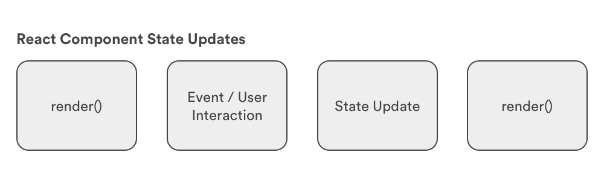
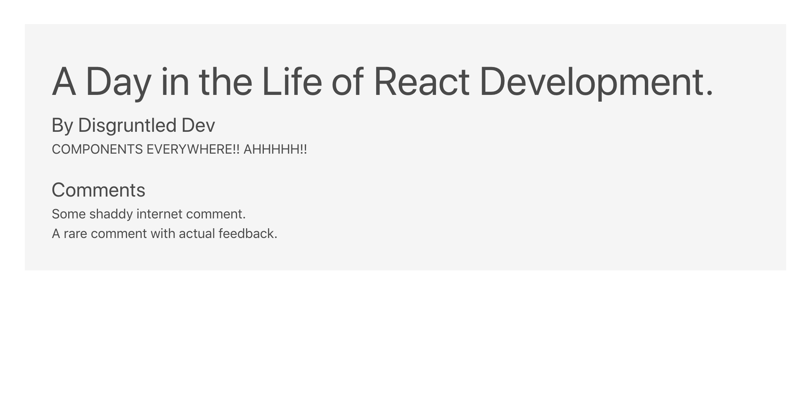

# State and Data-flow

## Learning Objectives

* Review passing data to a React component via `props`.
* Define and use nested components.
* Identify `state` in a React app.
* Modify the `state` of a React component through events.
* Distinguish container and presentational components.

## Framing

In this lesson we will be looking at how data is managed within a React application. In particular, we will compare and contrast a component's `props` and `state`. They are similar, but have a couple key distinctions:

* `props` are passed into a component, but `state` is local or native to the component
* While we cannot change `props` (immutable) from within a component, we can change a component's `state` (mutable).

## State

The limitation of props is that they are immutable; we can't change the data from within the component. The data that we can change within a component is called **[state](https://facebook.github.io/react/docs/state-and-lifecycle.html)**. 

We haven't talked about state much, but you have worked with it before. Think back to your game project. How did you track the score of the game, the current turn, whether or not the game had ended or not. These are all examples of state.

* **Trivia**: what is the current score, what card is currently displayed to the user, is the user's input correct or incorrect?
* **Simon**: what order of buttons did the user push, what is the order of buttons they were supposed to push, what round or level are they on?
* **Blackjack**: what is the score of the player's hand? The dealer's? How do we award money to a winning hand?

We can figure out the `state` of a turn-based game because there is a clear idea of a beginning and end and states that reflect progress from one turn to the next turn: what flash card is the user on, what buttons do they need to push, how the cards are distributed among the two players.


*Q: So we know an application can have different states. But how do we transition in between them?*

Events! (or user actions)


### F.I.R.S.T. Principles and State

The aim of the F.I.R.S.T. principles is to create a sane approach to breaking down not just a user interface, but also an application's data. Following the F.I.R.S.T principles should lead you to manageable, focused components that work with a specific set of data: the **props** we pass to those components and the **state** of the component itself.

*Each component is concerned only with the data relevant to its purpose*.

For your first project, you had to do that manually. Manually write event listeners that would update state stored in global scope and then update your UI by manually updating individual DOM nodes.

You can think of React as an event-driven state machine, in other words, a react app churns out new states as a result of user interactions. 

A React application receives input through user interactions (event listeners) and outputs a UI that reflects a brand new state (new cards, fewer or more chips, etc).


 *Q: What do we mean by a React component's "state"?*

The object properties of a component (`state`) that change as the application runs, as opposed to `props`, which are immutable.


### State and Rendering

Before moving on to build our application, it's worth mentioning another aspect of `state`: when it changes our components re-render.



Our UI updates when state changes. The user takes some action, like submitting information via a form, and the component holding that form has a `state` that is updated with the value of the user's input.

### Props vs State

Just a recap, both **props** and **state** are plain JS objects that hold information, but when updated re-renders the component. However they are different in one important way, `props` get passed to the component whereas `state` is managed within a component.

## Let's build something together.

Together we are going to grow our blog application with state and props! Yay!

Start by cloning this repo, then follow these instructions:

```bash
cd react-state-and-props/blog-app
npm install
npm start
```
You should be greeted with a Hello message. 

Now let's install a handy tool.
1. Chrome: [React Dev Tools](https://chrome.google.com/webstore/detail/react-developer-tools/fmkadmapgofadopljbjfkapdkoienihi?hl=en)
2. Firefox: [React Dev Tools](https://addons.mozilla.org/en-US/firefox/addon/react-devtools/)

At the moment we will see our `Hello` component inside of google chrome's development tools under the React tab. (We can even see our props/state!)

Now let's create two new component files inside the `src` folder.

Your structure should look like this:

```
blog-app
├──  favicon.ico
├──  public
├──  node_modules
├──  package.json
└──  src
    ├──  Comment.js
    ├──  Post.js
    ├──  App.css
    ├──  App.js
    ├──  index.css
    ├──  index.js
    └──  logo.svg

```

Let's throw some info into those files! 

**src/Post.js**

```js
import React from 'react';
import Comment from './Comment';

function Post(props) {
    let comments = props.comments.map((comment, index) => (
        <Comment message={comment} key={index}/>
    ))

    return(
        <div>
            <h1>{props.title}</h1>
            <p>By {props.author}</p>
            <div>
                <p>{props.body}</p>
            </div>
            <h3>Comments:</h3>    
            {comments}
        </div>
    )
}

export default Post;
```

Let's break down the above code. We created a Post component that takes in the props: title, author, body, and an array of comments. For each comment inside of *this.props.comments* it will create a Comment component. Since this file requires the Comment component let's update that next. 

**src/Comment.js**

```js
import React from 'react';

const Comment = (props) => {
    return(
        <div>
            <p>{props.message}</p>
        </div>
    )
}

export default Comment;
```

Awesome! Now update `index.js` to render out the Post component.

```js
import React from 'react';
import ReactDOM from 'react-dom';
import './index.css';
import Post from './Post';
import * as serviceWorker from './serviceWorker';

const post = {
    title: "Avengers",
    author: "Nick Fury",
    body: "I secretly recruited a group of superheroes to save our world.",
    comments: [
      "I love Avengers.",
      "Forget Avengers, we want the Witcher.",
      "At least let aliens destroy D&D for what they did to GOT!"
    ]
}

ReactDOM.render(
    <Post 
        title={post.title} 
        author={post.author}
        body={post.body} 
        comments={post.comments}/>, 
    document.getElementById('root')
);

// If you want your app to work offline and load faster, you can change
// unregister() to register() below. Note this comes with some pitfalls.
// Learn more about service workers: https://bit.ly/CRA-PWA
serviceWorker.unregister();
```

As you can see we are rendering a Post component with the props that we defined earlier.

You should see this now: 



So far we have used props to pass information from one component to another. But, what if we wanted data to change within a component? Props are immutable and as such can't be changed while the app is running. Time for `state`!

Unfortunately, introducing `state` means exposing the limitations of our functional components and learning about a new syntax for defining components called "Class-based components".

However easy *functional components* are to read, debug or test but they do not have state or lifecycle methods. Class-based components do. Both of these new concepts (state, and lifecycle methods) are important in React development, which is why we need to learn how to write a class component.

### Functional vs Class Component

#### Syntax
One of the obvious differences between these types of components is the syntax.

Functional components, as the name implies, are just like a regular js function with access to a `props` argument.

```
import React from 'react';

function Welcome(props) {
  return <h1>Hello, {props.name}</h1>;
}
```

Class components, again as the name implies, are written in JS class syntax and inherits properties and a lot of functionality from `React.Component`.

```
import React from 'react';

class Welcome extends React.Component {
  render() {
    return <h1>Hello, {this.props.name}</h1>;
  }
}
```

Notice the use of `this` to call the property name. Why do we have to use the `this` keyword here?

#### State

Functional components are **stateless** that means they don't have access to state. 

Class components are **stateful**, state can be accessed and updated.

> Technically, this has changed post React 16.8 release. We now have something called "hooks" for changing the state in a functional component. But for simplicity sake we will say that state cannot be changed in functional component.

#### Lifecycle Methods

Another feature that cannot be used in functional components are "lifecycle methods". Lifecycle methods run at specific times in the rendering, mounting, and unmounting phases of a component's life. Functional components don't have access to these methods for the same reason that they don't have access to state: all lifecycle methods are inherited from `React.Component` through the extend syntax.

So,if you need lifecycle methods you need a class component.

> This has also changed post React 16.8 hooks update.

### Code Along: Adding a state object

We're going to add "Karma" to our comments in order to show the user which comments are positive and which are negative by changing their colour.

We need a class-based component to add and access state. Let's first change the syntax of our functional `Comment` component to the Class-based alternative.

```js
import React, {Component} from 'react'

class Comment extends Component {

}

export default Comment
```

Since this is a class, instead of adding a `return` (which is not possible), we will use `render()` to return JSX when this component is invoked.

```js
import React, {Component} from 'react'

class Comment extends Component {
  render () {
    return (
      <div>
	<p>{this.props.message}</p>
      </div>
    )
  }
}

export default Comment
```

> `this` keyword is used to access `message` property sent from `Post`

Let's set state inside of our comments. And we will use the `karma` state to set class name in `div`

```js
import React, {Component} from 'react'

class Comment extends Component {
  state = {
    karma: 'good'
  };

  render () {
    return (
      <div className={this.state.karma}>
        <p>{this.props.message}</p>
      </div>
    )
  }
}

export default Comment
```

As you can see `state` is an object with key-value pair.

Inside our React Developer Tools we will now see that by default we have set the state of karma to 'good' for all comments. We also used this state to declare a classname attached to our comment component. Now that we have a set state we can now create a method built into our component to update the state.

We will be creating a `changeKarma` method to update our `state` and a button that will call trigger that update by calling the new method. Simply put, the function checks the state and toggles it depending on the current value. While we're at it, let's add some gifs.

```js
import React, {Component} from 'react'

class Comment extends Component {
  state = {
    karma: 'good'
  };

  changeKarma = () => {
    if (this.state.karma === 'good'){
      this.setState({
        karma: 'bad'
      })
    } else {
      this.setState({
        karma: 'good'
      })
    }
  }

  render () {
    let goodKarmaSrc = "https://media.giphy.com/media/1zJFtdNUhblPRT1yQy/giphy.gif";
    let badKarmaSrc = "https://media.giphy.com/media/AxVvk4TmDfmoMtSmmQ/giphy.gif";
    
    return (
      <div className={this.state.karma}>
        
        <p>{this.props.message}</p>
        <button className={"button"} onClick={this.changeKarma}>Change Karma</button>
      </div>
    )
  }
}

export default Comment
```

> Notice the use of ternary operator to change the gif in the `img` tag

So onClick the button will run the method changeKarma. 

Even though our `className` is changing on click of the button, nothing really is happens on the screen. So let's add a bit of styling in `index.css` to see some changes.

```
.good,
.bad {
  padding: 20px;
}

.good img {
  border: 5px solid green;
  width: 200px;
}

.bad img {
  border: 5px solid red;
  width: 200px;
}
```


Amazing!  Now when we click on our button the class attached to the component is switched without having to refresh the page. 


## Check for Understanding

* What is the difference between `state` and `props`?
* What do we use `props` for?
* What do we use `state` for?

We've done a fair amount of framing so far, so let's practice with another application: React Counters!


## Closing 

If asked, could you explain the differences between props and state? If not, reread this lesson and build out another Counters app, repitition is the key to understanding React. We've now covered the differences between the two as well as how you can use state to control data inside a component and how to update state to display new data to a user.

Defining components and working with props and state (data) constitutes the majority of the work of building a React application.

## Bonus

### Style in React

When it comes to adding styles to React, there is a bit of debate over what's the best practice. Facebook's official docs and recommendations are to write stylesheets that treat your CSS rule declarations as properties on one big Javascript object that can be passed into components via inline styles.

From the [Docs](https://facebook.github.io/react/tips/inline-styles.html)...

>  "In React, inline styles are not specified as a string. Instead they are specified with an object whose key is the camelCased version of the style name, and whose value is the style's value, usually a string"

However, this kind of rethinking the wheel feels like a step backwards for a lot of designers and developers who cringe at the notion of inline styles. For them, they choose to build React apps through a more traditional flow of adding ids and classes and then targeting elements via external stylesheets.

Also, via Webpack and other custom loaders, it is possible to use many third-party libraries or processors such as SASS, LESS, and Post-CSS.

Interesting to note, this problem has not been universally solved, and thus the debate will most likely continue to rage on until somebody figures it out. Therefore, its often left to a team decision when choosing the best option for the application.

Interested in learning more? Check out some excellent blog posts on the subject from the front-end community:
- https://medium.com/@jviereck/modularise-css-the-react-way-1e817b317b04#.61qgjgdu3
- http://jamesknelson.com/why-you-shouldnt-style-with-javascript/
- http://stackoverflow.com/questions/26882177/react-js-inline-style-best-practices
- https://css-tricks.com/the-debate-around-do-we-even-need-css-anymore/

### [Example of Object Literal Styles with React](https://github.com/ga-wdi-exercises/react-omdb/commit/830697fc68dcdccafcae9f73e711103de8d93fc9)

> **Reminder**: `class` is a protected keyword in React, in order to add a class attribute to an element use the keyword `className`

To add the finishing touches to our application, let's take a stab at styling our app with inline-styles and advance our markup with some help from Bootstrap...
- Load in Bootstrap CDN in `index.html`
- Modify UI to include Bootstrap classes
- Create a `styles` directory and make a file for your CSS rule definitions - this will be written in Javascript!
- Load in that file in any component and then use that to apply inline styling

### Resources

* [Imperative vs. Declarative Javascript](http://www.tysoncadenhead.com/blog/the-state-of-javascript-a-shift-from-imperative-to-declarative#.VxgGxZMrKfQ)
* [Styling in React](http://survivejs.com/webpack_react/styling_react/)
* [ReactJS Fundamentals Course](http://courses.reactjsprogram.com/courses/reactjsfundamentals)
